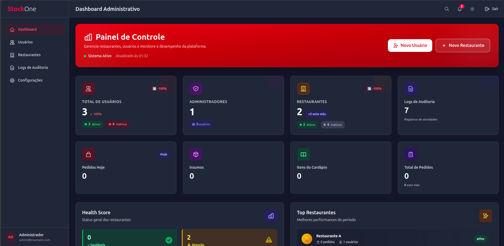
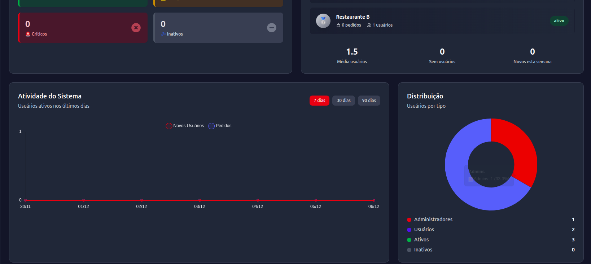
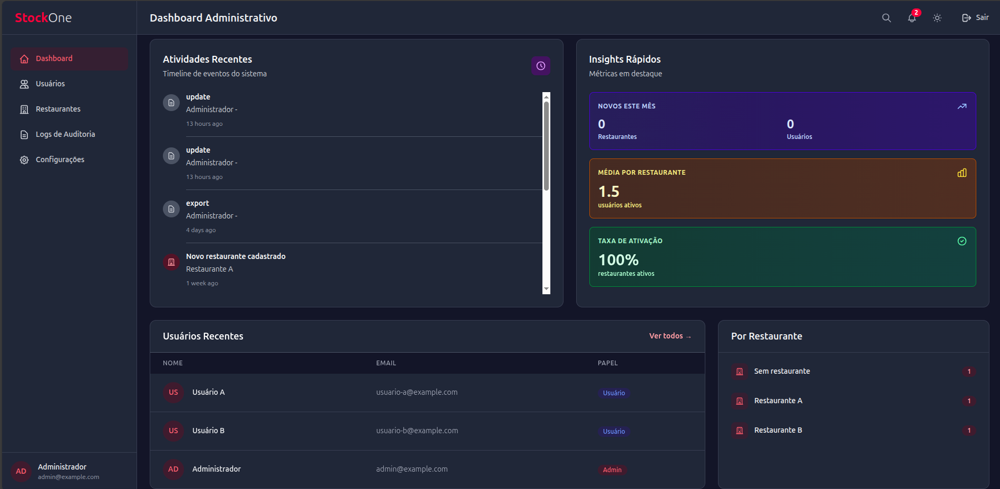
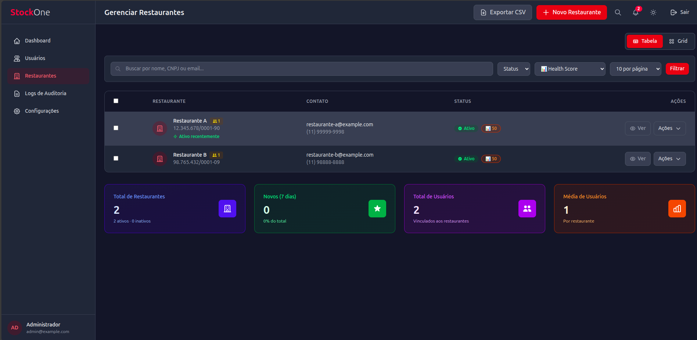
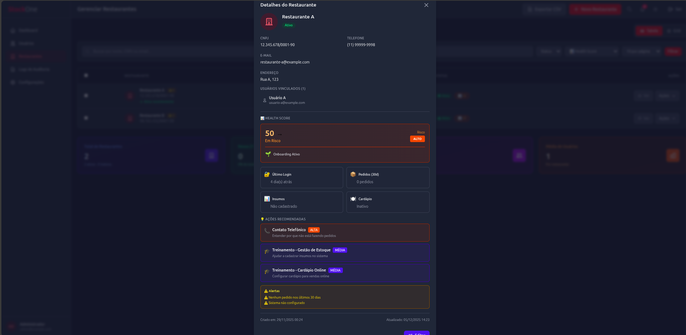

<div align="center">

# 🍽️ StockOne Laravel

### Sistema Completo de Gestão para Restaurantes

[](https://laravel.com)
[](https://php.net)
[](https://filamentphp.com)
[](https://tailwindcss.com)
[](https://alpinejs.dev)

</div>

---

## 📋 Índice

- [Sobre o Projeto](#-sobre-o-projeto)
- [Funcionalidades](#-funcionalidades)
- [Tecnologias](#-tecnologias)
- [Requisitos](#-requisitos)
- [Instalação](#-instalação)
- [Configuração](#-configuração)
- [Estrutura do Projeto](#-estrutura-do-projeto)
- [Módulos](#-módulos)
- [Health Score System](#-health-score-system)
- [Capturas de Tela](#-capturas-de-tela)
- [Contribuindo](#-contribuindo)
- [Licença](#-licença)

---

## 🎯 Sobre o Projeto

**StockOne** é uma solução completa de gestão para restaurantes, desenvolvida com Laravel 12, oferecendo controle total sobre:

- 📦 **Gestão de Estoque** - Controle preciso de insumos e produtos
- 🍽️ **Cardápio Online** - Sistema de pedidos digitais
- 👥 **Multi-restaurante** - Suporte para múltiplos estabelecimentos
- 📊 **Dashboard Administrativo** - Análises e métricas em tempo real
- 🔔 **Sistema de Notificações** - Alertas inteligentes sobre estoque e pedidos
- 📈 **Health Score** - Monitoramento de saúde e engajamento dos restaurantes
- 🔒 **Auditoria Completa** - Rastreamento de todas as ações no sistema

---

## ✨ Funcionalidades

### 🏪 Gestão de Restaurantes
- ✅ Cadastro e gerenciamento de múltiplos restaurantes
- ✅ Sistema de Health Score (0-100 pontos)
- ✅ Análise de ciclo de vida do cliente
- ✅ Ações recomendadas automáticas
- ✅ Histórico de engajamento e atividade
- ✅ Filtros avançados por status e risco

### 📦 Controle de Estoque
- ✅ Gestão completa de insumos
- ✅ Alertas automáticos de estoque baixo
- ✅ Sugestões inteligentes de compra
- ✅ Histórico de movimentações
- ✅ Controle de validade

### 🍽️ Cardápio Digital

---

## 🍽️ Cardápio Dinâmico

O sistema oferece um cardápio dinâmico, permitindo:

- **Gerenciamento de Itens**: Controle de disponibilidade, preço e ingredientes dos itens do cardápio em tempo real.
- **Sugestão de Pratos do Dia e Promoções**: Algoritmos inteligentes sugerem pratos do dia e promoções baseadas em estoque, sazonalidade e preferências dos clientes.
- **Integração com Estoque**: Atualização automática da disponibilidade dos itens conforme o consumo e movimentação de insumos, evitando vendas de produtos indisponíveis.

Essas funcionalidades garantem flexibilidade, agilidade e maior engajamento dos clientes, além de otimizar o uso dos insumos e reduzir desperdícios.

### 📋 Sistema de Pedidos
- ✅ Pedidos online integrados
- ✅ Fila de produção
- ✅ Status em tempo real
- ✅ Histórico completo
- ✅ Relatórios detalhados

### 👤 Gestão de Usuários
- ✅ Sistema de autenticação seguro
- ✅ Níveis de permissão (Admin/Usuário)
- ✅ Rastreamento de atividades
- ✅ Logs de auditoria
- ✅ Histórico de login

### 📊 Dashboard Administrativo
- ✅ Métricas em tempo real
- ✅ Gráficos interativos
- ✅ Estatísticas de vendas
- ✅ Análise de restaurantes
- ✅ Notificações centralizadas

### 🔔 Sistema de Notificações
- ✅ Alertas de estoque baixo
- ✅ Avisos de vencimento
- ✅ Notificações de pedidos
- ✅ Sistema de prioridades
- ✅ Marcação de lidas/não lidas

---

## 🛠️ Tecnologias

### Backend
- **Laravel 12** - Framework PHP moderno
- **PHP 8.2+** - Linguagem de programação
- **MySQL/PostgreSQL** - Banco de dados relacional
- **Filament 4.1** - Painel administrativo elegante

### Frontend
- **TailwindCSS 3.4** - Framework CSS utility-first
- **Alpine.js 3.x** - Framework JavaScript reativo
- **Blade Templates** - Engine de templates do Laravel
- **Vite 7.x** - Build tool moderna

### Ferramentas de Desenvolvimento
- **Laravel Pint** - Code style fixer
- **PHPUnit** - Testes unitários
- **Laravel Sail** - Ambiente Docker
- **Composer** - Gerenciador de dependências PHP
- **NPM** - Gerenciador de dependências JavaScript

---

## 📋 Requisitos

- PHP >= 8.2
- Composer >= 2.x
- Node.js >= 18.x
- NPM >= 9.x
- MySQL >= 8.0 ou PostgreSQL >= 13
- Apache/Nginx (para produção)

---

## 🚀 Instalação

### 1. Clone o Repositório

```bash
git clone https://github.com/FelipevSampaio/StockOneLaravel.git
cd StockOneLaravel
```

### 2. Instale as Dependências PHP

```bash
composer install
```

### 3. Instale as Dependências JavaScript

```bash
npm install
```

### 4. Configure o Ambiente

```bash
# Copie o arquivo de ambiente
cp .env.example .env

# Gere a chave da aplicação
php artisan key:generate
```

### 5. Configure o Banco de Dados

Edite o arquivo `.env` com suas credenciais:

```env
DB_CONNECTION=mysql
DB_HOST=127.0.0.1
DB_PORT=3306
DB_DATABASE=stockone
DB_USERNAME=seu_usuario
DB_PASSWORD=sua_senha
```

### 6. Execute as Migrations

```bash
php artisan migrate --seed
```

### 7. Compile os Assets

```bash
# Desenvolvimento
npm run dev

# Produção
npm run build
```

### 8. Inicie o Servidor

```bash
php artisan serve
```

Acesse: `http://localhost:8000`

---

## ⚙️ Configuração

### Usuário Administrador Padrão

Após executar as seeders, use estas credenciais:

```
Email: admin@stockone.com
Senha: admin123
```

> ⚠️ **IMPORTANTE**: Altere essas credenciais em produção!

### Configuração de E-mail

Configure o SMTP no `.env`:

```env
MAIL_MAILER=smtp
MAIL_HOST=smtp.mailtrap.io
MAIL_PORT=2525
MAIL_USERNAME=seu_username
MAIL_PASSWORD=sua_senha
MAIL_ENCRYPTION=tls
MAIL_FROM_ADDRESS=noreply@stockone.com
MAIL_FROM_NAME="${APP_NAME}"
```

### Sistema de Filas (Opcional)

Para notificações assíncronas:

```bash
# Configure no .env
QUEUE_CONNECTION=database

# Execute o worker
php artisan queue:work
```

### Health Score Histórico (Cron)

Adicione ao crontab para salvar histórico diário:

```bash
# Edite o crontab
crontab -e

# Adicione esta linha
0 0 * * * cd /caminho/do/projeto && php artisan schedule:run >> /dev/null 2>&1
```

---

## 📁 Estrutura do Projeto

```
StockOne_Laravel/
├── app/
│   ├── Http/
│   │   ├── Controllers/
│   │   │   ├── AdminController.php
│   │   │   ├── RestauranteAdminController.php
│   │   │   ├── DashboardAdminController.php
│   │   │   ├── PublicMenuController.php
│   │   │   └── ...
│   │   └── Middleware/
│   │       └── AdminMiddleware.php
│   ├── Models/
│   │   ├── Restaurante.php        # Model com Health Score
│   │   ├── User.php
│   │   ├── Pedido.php
│   │   ├── Estoque.php
│   │   ├── CardapioItem.php
│   │   └── ...
│   └── Support/
│       └── PublicCart.php          # Carrinho de compras
├── database/
│   ├── migrations/
│   │   ├── 2025_10_30_000147_create_restaurantes_table.php
│   │   ├── 2025_12_05_143204_create_health_score_history_table.php
│   │   └── ...
│   └── seeders/
├── resources/
│   ├── css/
│   │   └── app.css
│   ├── js/
│   │   └── app.js
│   └── views/
│       ├── admin/                  # Views administrativas
│       │   ├── dashboard.blade.php
│       │   ├── restaurantes/
│       │   ├── notifications/
│       │   └── ...
│       ├── layouts/
│       │   ├── admin.blade.php     # Layout admin
│       │   └── app.blade.php       # Layout público
│       └── public/
│           └── menu.blade.php      # Cardápio online
├── routes/
│   ├── web.php                     # Rotas da aplicação
│   └── console.php
├── composer.json
├── package.json
├── tailwind.config.js
├── vite.config.js
└── README.md
```

---

## 🎨 Módulos

### 1. Painel Administrativo (`/admin`)

**Dashboard Principal**
- Estatísticas em tempo real
- Gráficos de atividade
- Resumo de restaurantes
- Notificações importantes

**Gestão de Restaurantes**
- Listagem com Health Score
- Criação/Edição/Exclusão
- Filtros avançados
- Exportação CSV
- Ações em massa
- Quick View detalhado

**Notificações**
- Central de notificações
- Filtros por tipo e prioridade
- Marcação de lidas
- Ações diretas

**Auditoria**
- Logs de todas as ações
- Filtros por usuário/data/ação
- Exportação de relatórios

**Configurações**
- Configurações gerais do sistema
- Preferências de usuário
- Temas (claro/escuro)

### 2. Área do Restaurante

**Dashboard**
- Visão geral do restaurante
- Pedidos do dia
- Alertas de estoque
- Estatísticas rápidas

**Gestão de Estoque**
- Lista de insumos
- Controle de entrada/saída
- Alertas automáticos
- Sugestões de compra

**Cardápio**
- Gerenciamento de itens
- Categorias e preços
- Status online/offline
- Receitas e composição

**Pedidos**
- Listagem de pedidos
- Fila de produção
- Histórico completo

### 3. Área Pública

**Cardápio Online** (`/menu`)
- Visualização do cardápio
- Carrinho de compras
- Checkout simplificado
- Sistema de sessão

---

## 📊 Health Score System

### O que é?

Sistema inteligente que calcula uma pontuação de 0 a 100 para cada restaurante, baseado em:

| Métrica | Pontos | Descrição |
|---------|--------|-----------|
| 🔐 **Último Login** | 40 pts | Atividade recente dos usuários |
| 📦 **Pedidos no Mês** | 30 pts | Volume de pedidos (últimos 30 dias) |
| ⚙️ **Configuração** | 20 pts | Sistema configurado (insumos + cardápio) |
| 👥 **Usuários** | 10 pts | Possui usuários vinculados |

### Níveis de Risco

- 🟢 **Baixo** (80-100): Cliente ativo e engajado
- 🟡 **Médio** (60-79): Atenção necessária
- 🟠 **Alto** (30-59): Em risco de churn
- 🔴 **Crítico** (0-29): Intervenção urgente

### Funcionalidades

✅ **Tendência** - Comparação com mês anterior  
✅ **Histórico** - Evolução dos últimos 90 dias  
✅ **Ciclo de Vida** - Onboarding, Ativo, Em Risco, etc.  
✅ **Ações Recomendadas** - Sugestões automáticas baseadas em problemas  
✅ **Alertas** - Notificações sobre problemas identificados  

### Como Usar

```php
// No Controller
$restaurante = Restaurante::find(1);
$healthData = $restaurante->calculateHealthScore();

// Retorna:
[
    'score' => 85,
    'status' => 'Ativo',
    'color' => 'green',
    'risk' => 'baixo',
    'last_login_days' => 2,
    'pedidos_mes' => 15,
    'tem_insumos' => true,
    'tem_cardapio' => true,
    'tem_usuarios' => true,
    'alerts' => []
]

// Obter tendência
$trend = $restaurante->getHealthTrend();

// Obter ações recomendadas
$actions = $restaurante->getRecommendedActions();

// Obter ciclo de vida
$lifecycle = $restaurante->getLifecycleStage();
```

### Salvar Histórico (Cron Diário)

```php
// No schedule (app/Console/Kernel.php)
$schedule->call(function () {
    Restaurante::all()->each->saveHealthScoreHistory();
})->daily();
```

---

## 📸 Capturas de Tela

### 🎨 Dashboard Administrativo

<div align="center">

#### Visão Geral do Dashboard

<br>

<br>

*Dashboard com métricas em tempo real, gráficos de atividade e estatísticas gerais*

---
#### Gestão de Usuários 

<br>

*Gestão de usuários, podendo criar, remover, e limitar as permissões*

---
#### Gestão de Restaurantes com Health Score

*Lista de restaurantes com filtros avançados e badges de Health Score*

---


</div>

### 🍽️ Área do Restaurante

<div align="center">

#### Gestão de Estoque

*Controle completo de insumos com alertas de estoque baixo*

---

#### Cardápio Digital

*Gerenciamento de itens do cardápio com categorização*

---

#### Sistema de Pedidos

*Visualização e gestão de pedidos em tempo real*

</div>

### 🌐 Área Pública

<div align="center">

#### Cardápio Online

*Interface responsiva do cardápio para clientes*

---

#### Sistema de Notificações

*Central de notificações com prioridades e filtros*

</div>

### 🎨 Temas

<div align="center">

#### Modo Claro


#### Modo Escuro


</div>

---

> 💡 **Como adicionar screenshots:**
> 
> 1. Tire prints das telas do sistema
> 2. Salve os arquivos na pasta `docs/screenshots/` com os nomes correspondentes:
>    - `dashboard-admin.png`
>    - `restaurantes-list.png`
>    - `quick-view-modal.png`
>    - `estoque.png`
>    - `cardapio.png`
>    - `pedidos.png`
>    - `menu-publico.png`
>    - `notificacoes.png`
>    - `tema-claro.png`
>    - `tema-escuro.png`
> 3. Faça commit e push das imagens
> 4. As imagens aparecerão automaticamente no README!

---

## 🤝 Contribuindo

Contribuições são bem-vindas! Siga estes passos:

1. **Fork** o projeto
2. Crie uma **branch** para sua feature (`git checkout -b feature/MinhaFeature`)
3. **Commit** suas mudanças (`git commit -m 'feat: Adiciona MinhaFeature'`)
4. **Push** para a branch (`git push origin feature/MinhaFeature`)
5. Abra um **Pull Request**

### Padrões de Commit

Seguimos o [Conventional Commits](https://www.conventionalcommits.org/):

- `feat:` - Nova funcionalidade
- `fix:` - Correção de bug
- `docs:` - Documentação
- `style:` - Formatação de código
- `refactor:` - Refatoração
- `test:` - Testes
- `chore:` - Manutenção

---

## 📝 Licença

Este projeto está sob a licença MIT. Veja o arquivo [LICENSE](LICENSE) para mais detalhes.

---

## 👥 Autores

- **Clayton Silva** - [@CLSilva2](https://github.com/CLSilva2).
- **Felipe Sampaio** - [@FelipevSampaio](https://github.com/FelipevSampaio).
- **PedroSantos719** - [@PedroSantos719](https://github.com/PedroSantos719).
- **Rodrigo Nascimento** -[@RD57L1](https://github.com/RD57L1).
- **ThiagoSantos** - [@ThiagoSantos19](https://github.com/ThiagoSantos19).

---

## 📞 Suporte

Para reportar bugs ou solicitar funcionalidades:
- 📧 Email: suporte@stockone.com
- 🐛 Issues: [GitHub Issues](https://github.com/FelipevSampaio/StockOneLaravel/issues)

---

## 🙏 Agradecimentos

- [Laravel](https://laravel.com) - Framework PHP
- [Filament](https://filamentphp.com) - Painel administrativo
- [TailwindCSS](https://tailwindcss.com) - Framework CSS
- [Alpine.js](https://alpinejs.dev) - Framework JavaScript

---

<div align="center">

**Feito com ❤️ para revolucionar a gestão de restaurantes**

⭐ Se este projeto foi útil, considere dar uma estrela!

</div>
